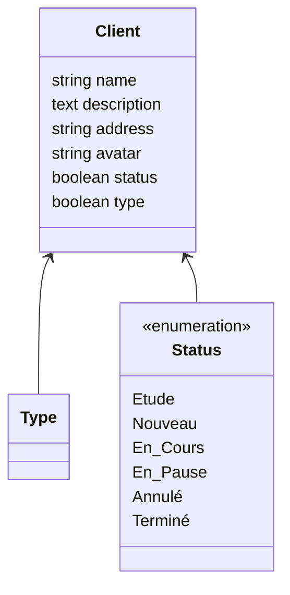

# Diagram

```mermaid
classDiagram

class Client{
    string name
    text description
    string address
    string avatar
    boolean status
    boolean type
}

class Status{
    <<enumeration>>
    Etude
    Nouveau
    En_Cours
    En_Pause
    Annulé
    Terminé
}

Client <-- Type
Client <-- Status
```

