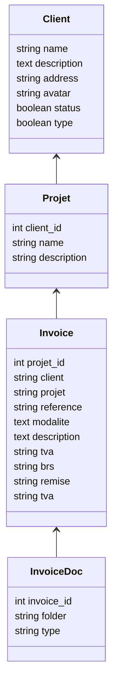

# Diagram

```mermaid
classDiagram

class Client{
    string name
    text description
    string address
    string avatar
    boolean status
    boolean type
}

Client <-- Projet
class Projet{
    int client_id
    string name
    string description

}

Projet <-- Invoice
class Invoice{
    int projet_id
    string client
    string projet
    string reference
    text modalite
    text description
    string tva
    string brs
    string remise
    string tva

}

Invoice <-- InvoiceDoc
class InvoiceDoc{
    int invoice_id
    string folder
    string type
}

```

