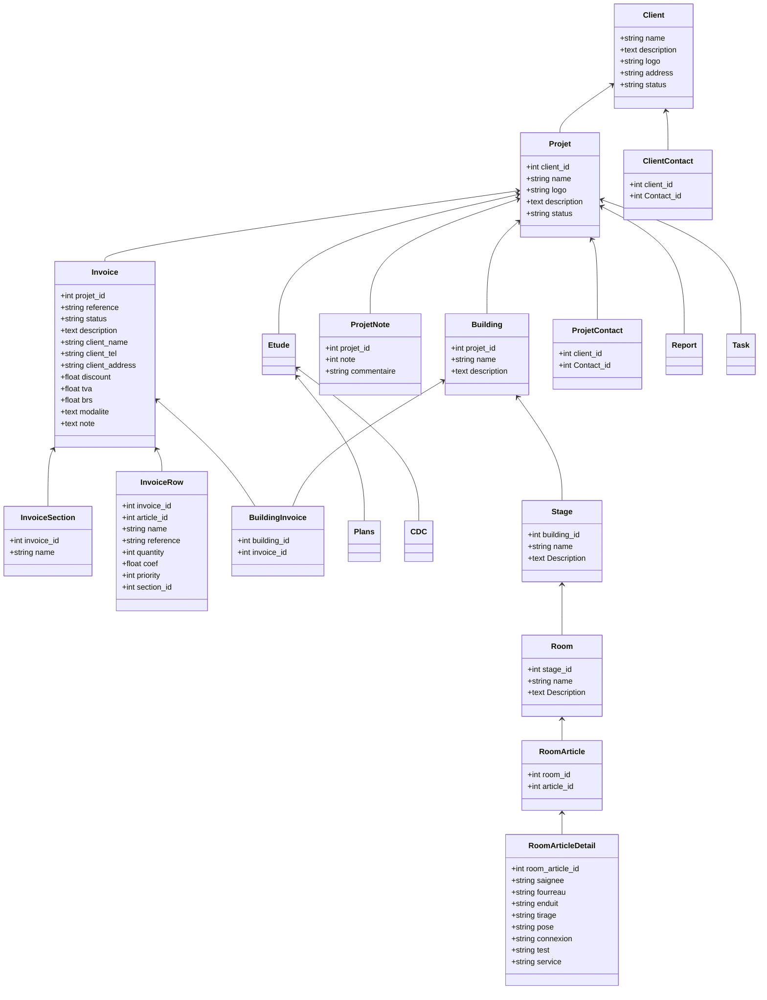
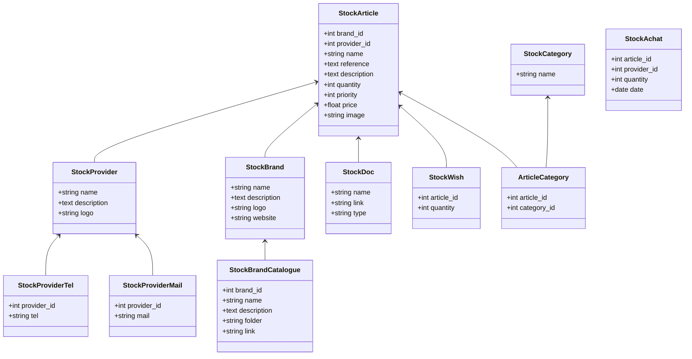

# Gestion de projets

## Diagramme de classe

```mermaid
classDiagram

Client <-- Projet
Client <-- ClientContact

Projet <-- Invoice
Projet <-- Etude
Projet <-- ProjetNote
Projet <-- Building
Projet <-- ProjetContact
Projet <-- Report
Projet <-- Task

Invoice <-- InvoiceSection
Invoice <-- InvoiceRow
Invoice <-- BuildingInvoice

Etude <-- Plans
Etude <-- CDC

Building <-- Stage
Stage <-- Room
Room <-- RoomArticle
RoomArticle <-- RoomArticleDetail

Building <-- BuildingInvoice

class Client{
    +string name
    +text description
    +string logo
    +string address
    +string status
}

class ClientContact{
    +int client_id
    +int Contact_id
}

class Projet{
    +int client_id
    +string name
    +string logo
    +text description
    +string status
}

class ProjetContact{
    +int client_id
    +int Contact_id
}

class Invoice{
    +int projet_id
    +string reference
    +string status
    +text description
    +string client_name
    +string client_tel
    +string client_address
    +float discount
    +float tva
    +float brs
    +text modalite
    +text note
}

class InvoiceRow{
    +int invoice_id
    +int article_id
    +string name
    +string reference
    +int quantity
    +float coef
    +int priority
    +int section_id
}

class InvoiceSection{
    +int invoice_id
    +string name
}

class Building{
    +int projet_id
    +string name
    +text description
}
class BuildingInvoice{
    +int building_id
    +int invoice_id
}
class Stage{
    +int building_id
    +string name
    +text Description
}
class Room{
    +int stage_id
    +string name
    +text Description
}
class RoomArticle{
    +int room_id
    +int article_id
}
class RoomArticleDetail{
    +int room_article_id
    +string saignee
    +string fourreau
    +string enduit 
    +string tirage 
    +string pose 
    +string connexion 
    +string test 
    +string service 
}

class ProjetNote{
    +int projet_id
    +int note
    +string commentaire
}


```

## Gestion de stock

```mermaid
classDiagram

class StockArticle{
    +int brand_id
    +int provider_id
    +string name
    +text reference
    +text description
    +int quantity
    +int priority
    +float price
    +string image
}
StockArticle <-- StockProvider
StockArticle <-- StockBrand
StockArticle <-- StockDoc
StockArticle <-- StockWish
StockArticle <-- ArticleCategory

class StockProvider{
    +string name
    +text description
    +string logo
}
StockProvider <-- StockProviderTel
StockProvider <-- StockProviderMail

class StockProviderTel{
    +int provider_id
    +string tel
}
class StockProviderMail{
    +int provider_id
    +string mail
}

class StockBrand{
    +string name
    +text description 
    +string logo
    +string website
}
class StockBrandCatalogue{
    +int brand_id
    +string name
    +text description 
    +string folder
    +string link
}
StockBrand <-- StockBrandCatalogue 

class ArticleCategory{
    +int article_id
    +int category_id
}
class StockCategory{
    +string name
}
StockCategory <-- ArticleCategory
class StockDoc{
    +string name
    +string link
    +string type
}
class StockWish{
    +int article_id
    +int quantity
}
class StockAchat{
    +int article_id
    +int provider_id
    +int quantity
    +date date
}
```
