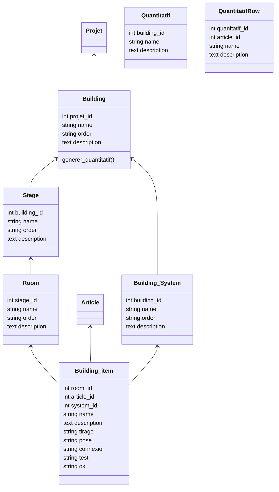

# Gestion de batiment

## Description

Ce module permet de documenter un projet.  

Chaque projet peut être composé de plusieurs **batiments**, chaque batiment est composé de **niveaux**, chaque niveau de **locaux**.  

Pour chacun des locaux des équipements seront affactés à partir des équipemetns cité dans le devis. IL faudra prendre en compte des équipemens annexes à ajouter à l'installation.  

Cette structure permettra de faire le suivi des travaux.  

| Tache | Etat | Commmentaire |
| :-- | :-- | :-- |
| Saignée | 000% |
| Pose de fourreau | 000% | |
| Enduit | 000% | |
| Tirage | 000% | |
| Pose | 000% | |
| Connexion | 000% | |
| Test | 000% | |
| Mise en service | 000% | |

