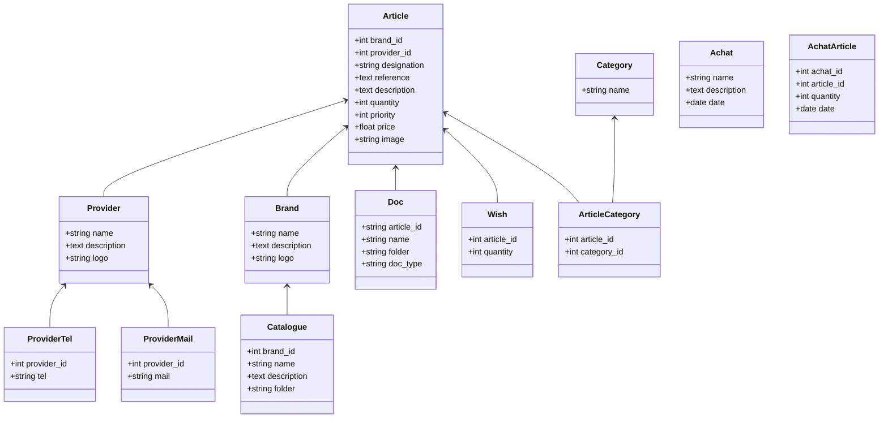

# Gestion du 

## Description

## Diagramme

```mermaid
classDiagram

class Article{
    +int brand_id
    +int provider_id
    +string designation
    +text reference
    +text description
    +int quantity
    +int priority
    +float price
    +string image
}
Article <-- Provider
Article <-- Brand
Article <-- Doc
Article <-- Wish
Article <-- ArticleCategory

class Provider{
    +string name
    +text description
    +string logo
}
Provider <-- ProviderTel
Provider <-- ProviderMail

class ProviderTel{
    +int provider_id
    +string tel
}
class ProviderMail{
    +int provider_id
    +string mail
}

class Brand{
    +string name
    +text description 
    +string logo
}
class Catalogue{
    +int brand_id
    +string name
    +text description 
    +string folder
}
Brand <-- Catalogue 

class ArticleCategory{
    +int article_id
    +int category_id
}
class Category{
    +string name
}
Category <-- ArticleCategory
class Doc{
    +string article_id
    +string name
    +string folder
    +string doc_type
}
class Wish{
    +int article_id
    +int quantity
}
class Achat{
    +string name
    +text description
    +date date
}
class AchatArticle{
    +int achat_id
    +int article_id
    +int quantity
    +date date
}
```
