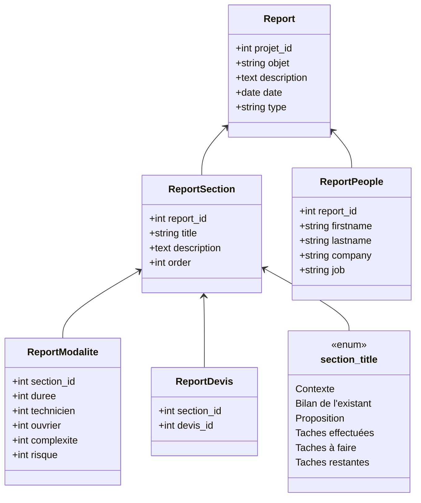

# Gestion des rapports

## Description

Les rapprots sont liés à des projets.  
Ils peuvent être de différents types.  

## Diagrame de classe

```mermaid
classDiagram

Report <-- ReportSection
Report <-- ReportPeople
ReportSection <-- ReportModalite
ReportSection <-- ReportDevis
ReportSection <-- section_title

class Report{
    +int projet_id
    +string objet
    +text description
    +date date
    +string type
}

class ReportPeople{
    +int report_id
    +string firstname
    +string lastname
    +string company
    +string job
}

class ReportSection{
    +int report_id
    +string title
    +text description
    +int order
}

class ReportModalite{
    +int section_id
    +int duree
    +int technicien
    +int ouvrier
    +int complexite
    +int risque
}

class ReportDevis{
    +int section_id
    +int devis_id
}

class section_title{
    <<enum>>
    Contexte
    Bilan de l'existant
    Proposition
    Taches effectuées
    Taches à faire
    Taches restantes
}
```
