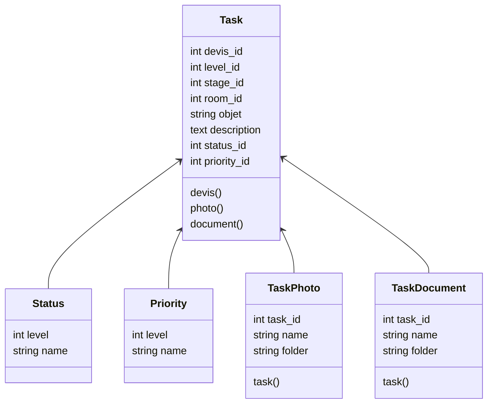

# Taches

## Description

Gestion et suivi des taches en cours

## Modèle

```mermaid
classDiagram

Task <-- Status
Task <-- Priority
Task <-- TaskPhoto
Task <-- TaskDocument

class Task{
    int devis_id
    int level_id
    int stage_id
    int room_id
    string objet
    text description
    int status_id
    int priority_id
    devis()
    photo()
    document()
}

class TaskPhoto{
    int task_id
    string name
    string folder
    task()
}

class TaskDocument{
    int task_id
    string name
    string folder
    task()
}

class Status{
    int level
    string name
}

class Priority{
    int level
    string name
}

```

## Sources
<!-- 
* 
*  -->
