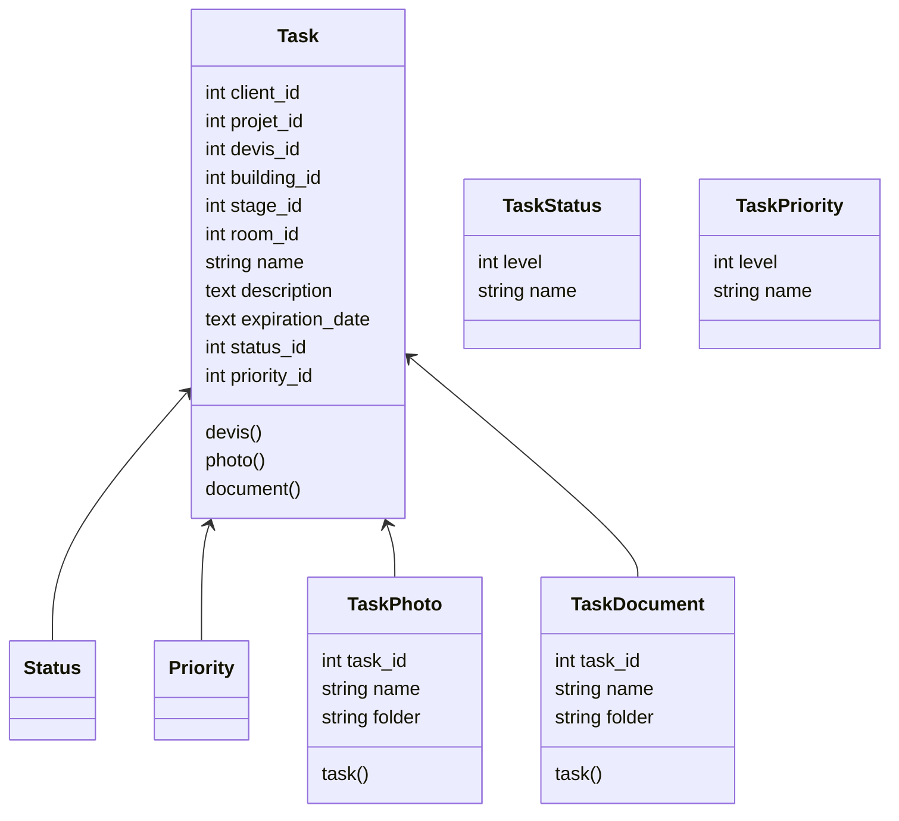

# Taches

## Description

Gestion et suivi des taches en cours

## Correspondances

| Id | Correspondance |
| :-- | :-- |
| 1 | Nouveau |
| 2 | En Cours |
| 3 | En pause |
| 4 | Terminé |
| 5 | Cloturé |

## Modèle

## Sources
<!-- 
* 
*  -->
