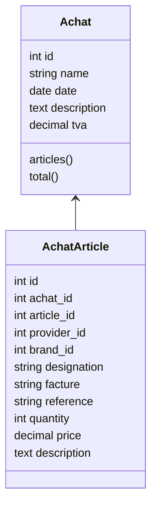

# Achats

[Retour](../readme.md)

## Description

Gestion des achats pour approvisionner les stocks.

## Diagramme de classe

```mermaid
classDiagram 

Achat <-- AchatArticle

class Achat{
    int id
    string name
    date date
    text description
    decimal tva

    articles()
    total()
}
class AchatArticle{
    int id
    int achat_id
    int article_id
    int provider_id
    int brand_id
    string designation
    string facture
    string reference
    int quantity
    decimal price
    text description
}
```

## Sources

* 
