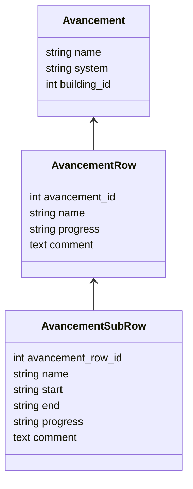

# Planning

## Description

## Diagramme

```mermaid
classDiagram

Avancement <-- AvancementRow
AvancementRow <-- AvancementSubRow

class Avancement{
    string name
    string system
    int building_id
}

class AvancementRow{
    int avancement_id
    string name
    string progress
    text comment
}

class AvancementSubRow{
    int avancement_row_id
    string name
    string start
    string end
    string progress
    text comment
}
```

## Sources

* 
