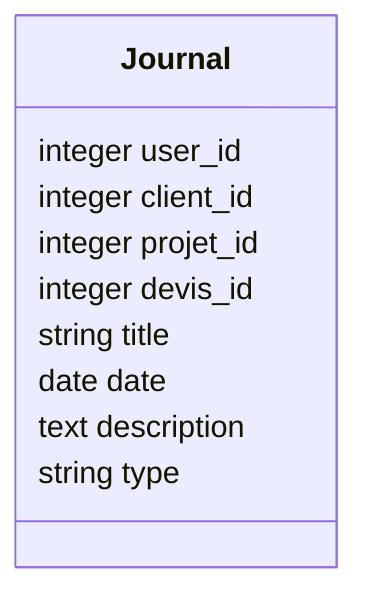

# [Journal](readme.md)

## Description

Il s'agit de journaux d'activité qui peuvent aussi faire office de rapport ou de proposition technique.

## Schéma

```mermaid
classDiagram

class Journal{
    integer user_id
    integer client_id
    integer projet_id
    integer devis_id
    string title
    date date
    text description
    string type
}
```

## Sources

* 
