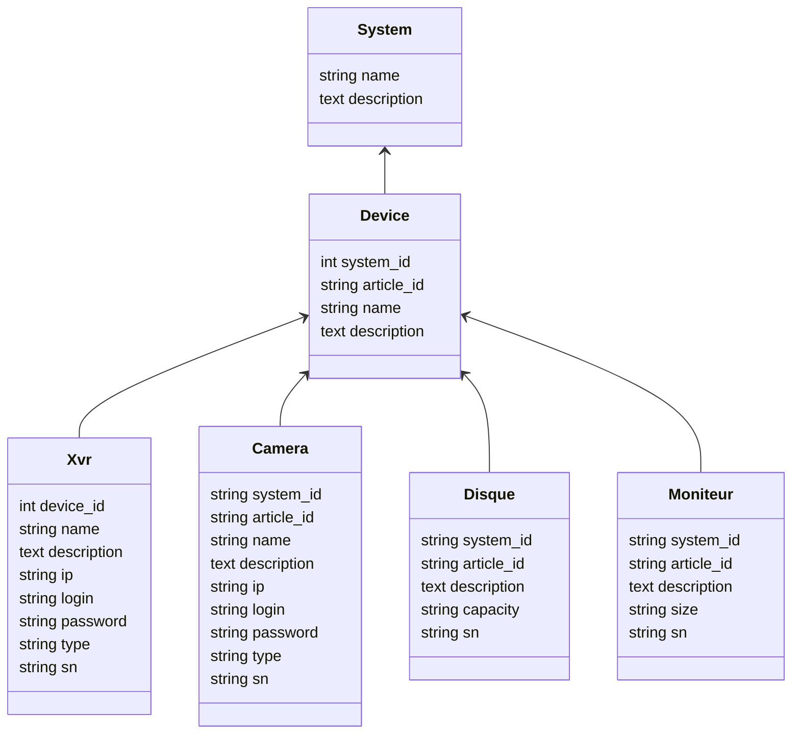

# [Equipments](readme.md)

## Diagramme

```mermaid
classDiagram


class System{
    string name
    text description
}
System <-- Device

class Device{
    int system_id
    string article_id
    string name
    text description
}
Device <-- Xvr
Device <-- Camera
Device <-- Disque
Device <-- Moniteur

class Xvr{
    int device_id
    string name
    text description
    string ip
    string login
    string password
    string type
    string sn
}
class Camera{
    string system_id
    string article_id
    string name
    text description
    string ip
    string login
    string password
    string type
    string sn
}
class Disque{
    string system_id
    string article_id
    text description
    string capacity
    string sn
}
class Moniteur{
    string system_id
    string article_id
    text description
    string size
    string sn
}


```
