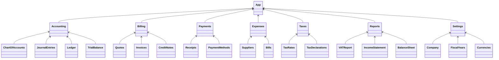

# [Titre](readme.md)

## Plan comptable

[Source](https://www.l-expert-comptable.com/plan-comptable)

 

```mermaid
classDiagram

App <-- Accounting 
App <-- Billing 
App <-- Payments 
App <-- Expenses 
App <-- Taxes 
App <-- Reports 
App <-- Settings 

Accounting <-- ChartOfAccounts
Accounting <-- JournalEntries
Accounting <-- Ledger
Accounting <-- TrialBalance

Billing <-- Quotes
Billing <-- Invoices
Billing <-- CreditNotes

Payments <-- Receipts
Payments <-- PaymentMethods

Expenses <-- Suppliers
Expenses <-- Bills

Taxes <-- TaxRates
Taxes <-- TaxDeclarations

Reports <-- VATReport
Reports <-- IncomeStatement
Reports <-- BalanceSheet

Settings <-- Company
Settings <-- FiscalYears
Settings <-- Currencies
```
