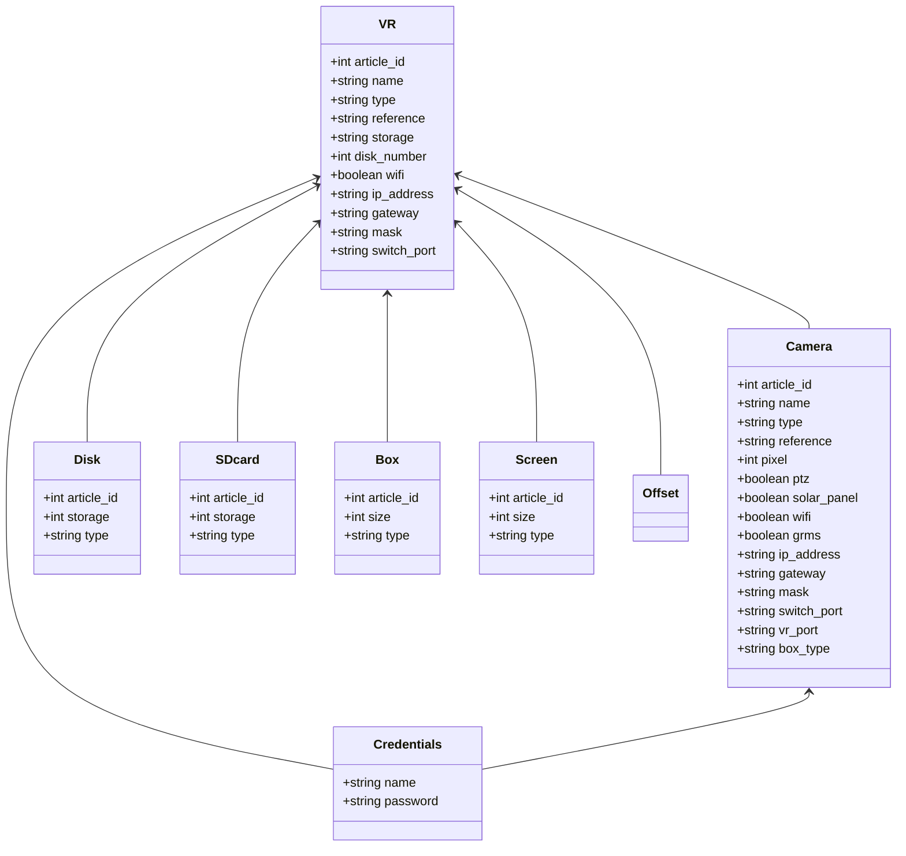

# Objet

## Description

## Diagramme

```mermaid
classDiagram
    VR <-- Camera 
    VR <-- Disk
    VR <-- SDcard
    VR <-- Box
    VR <-- Screen
    VR <-- Offset

    VR <-- Credentials
    Camera <-- Credentials

    class Credentials{
        +string name
        +string password
    }

    class VR{
        +int article_id
        +string name
        +string type
        +string reference
        +string storage
        +int disk_number
        +boolean wifi
        +string ip_address
        +string gateway
        +string mask
        +string switch_port
    }

    class Camera{
        +int article_id
        +string name
        +string type
        +string reference
        +int pixel
        +boolean ptz
        +boolean solar_panel
        +boolean wifi
        +boolean grms
        +string ip_address
        +string gateway
        +string mask
        +string switch_port
        +string vr_port
        +string box_type
    }

    class SDcard{
        +int article_id
        +int storage
        +string type
    }
    class Disk{
        +int article_id
        +int storage
        +string type
    }

    class Screen{
        +int article_id
        +int size
        +string type
    }

    class Box{
        +int article_id
        +int size
        +string type
    }

```
